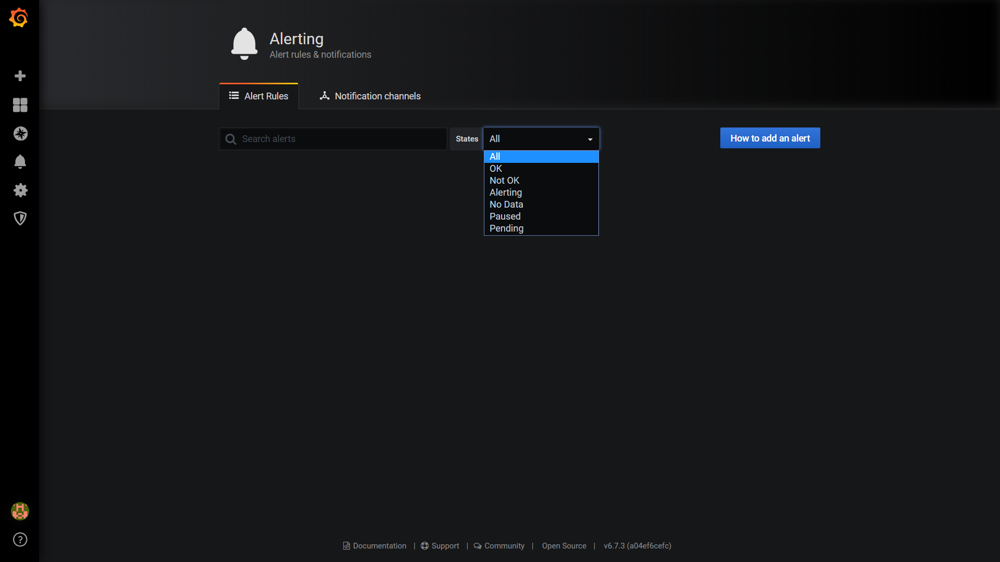

## Welcome to HawkEye
**DISCLAIMER: HAWKEYE IS A PROOF OF CONCEPT DEVELOPED FOR A HACKATHON, AND NOT A SANITARY OR HOSPITAL READY PRODUCT, AND SHOULD NOT BE USED IN SUCH A CONTEXT. THIS IS MERELY AN IDEA / STARTING POINT.**

## Rationale

COVID-19 has taken and continues to take a heavy toll on the health services around the world. 

[dashboard screenshot]()

**The shortages of Personal Protective Equipment are placing our health workers at risk.**

In order to protect them while maintaining a standard of care for patients, **HawkEye** was developed. 

HawkEye is a concept test of telemmetry for health applications. HawkEye can monitor blood pressure, temperature, pulse and oxygen (SP02) and transmit the results to a remote screen dashboard, in a clean area. While many hospitals do have telemetry for ECG, not all of them can cover all of these areas. If nurses and doctors have to go in 3-4 times a shift to measure each patient's blood pressure, oxygen, pulse, and temp, they have to don a full PPE kit, follow a strict procedure and spend a lot of time in the "dirty" area. Each time that they do this, there is an increased risk of contagion.

PPE is not perfect, and it is common for it to cause dehydration and fatigue. If they have to go in less times per shift, or for shorter amounts of time, their exposure would significantly decrease.

While they would still have to go in for specific tasks, they would be relieved of many repetitive and time consuming tasks. This is not completely feasible on a conscious patient, because you can't keep a conscious patient wearing a blood cuff all day long without causing discomfort, a patient that is sedated doesn't present this constraint.

The **goals** of HawkEye are threefold:

1. Reduce the amount of time that health workers spend on "dirty areas", reducing their exhaustion and exposure.
2. Reduce the amount of PPE used per shift.
3. Collect data quickly in order to facilitate research.

## How does it work?

HawkEye is based on REDIS TimeSeries and Grafana. It logs dummy IOT data (as would be received from a blood pressure monitor, a pulsioximeter and a digital thermometer) and displays it on a dashboard. Every event is timestamped and kept for future use. The fact that all data is kept as a REDIS TimeSeries allows for fast and easy manipulation, which coupled with Grafana, allows health personel to modify and adapt their alarms and metrics for each patient.

Given Grafana and REDIS TimeSeries capabilities, we are able to export data in a variety of channels. This, coupled with anonymization functions, could facilitate data redistribution directly to researchers in the span of a few seconds. 

For the whole system to work, the remote devices would have to allow some kind of remote connection. While some equipment allows Bluetooth connections, we haven't found any freely available medically approved blood pressure monitors that would allow a "push" or start (we are based in the EU). Nevertheless, the idea would be something like [this (not ours)](https://www.youtube.com/watch?v=17im1J1EdZA)

Since this is not always possible, because of the limitations of existing equipment, a few options are proposed:

1. Using an electronics solution (such as arduino) that manually pushes the button, such as depicted here (not ours): [The Claw - Instructables](https://www.instructables.com/id/The-Claw-A-3D-printed-robotic-claw/)
2. Using computer vision to get readings from each machine (depending on the available light in the room).
3. Implementing a modified device, connected to the medical device's board (might cause regulatory issues).
4. Buying newer medically approved devices that do allow remote start and stop.

